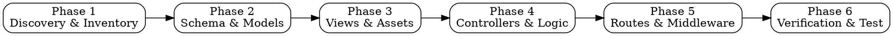

# CodeIgniter 3 to GoIgniter Migration Skill

A deterministic, production-grade migration system for migrating legacy PHP CodeIgniter 3 (CI3) applications to [GoIgniter](https://github.com/semutdev/goigniter) — the modern, idiomatic Go framework built with CodeIgniter-familiar developer experience (MVC, Active Record / Query Builder, flash sessions, template engine, form validation, and CLI commands).

---

## 1. Overview & Core Philosophy

Migrating dynamic PHP codebases to a statically typed, compiled language like Go can quickly consume enormous context windows and cause hallucination if handled naively by prompting an LLM to rewrite thousands of lines of PHP code.

This skill follows a **Hybrid Automation Architecture**:

1. **Zero-Token Mechanical Tooling**: Repetitive, deterministic parsing and conversion tasks are offloaded to specialized local Go CLI tools:
   - `inspect`: Scans the legacy CI3 directory, extracts controllers, models, views, libraries, helpers, config, routes, database tables, and produces an actionable migration inventory checklist.
   - `sql2struct`: Parses MySQL/PostgreSQL/SQLite DDL schemas and generates Go structs with struct tags (`db`, `json`), Active Record model definitions, and CRUD boilerplate.
   - `view2gotpl`: AST-aware transpiler converting PHP view files (`.php`) into Go `html/template` files (`.html`), rewriting PHP echo statements, conditionals, loops, CI3 helpers (`site_url`, `base_url`, `form_open`), and view partial includes (`$this->load->view`).

2. **Guided Agent Reasoning for Business Logic**: Agent intelligence is focused exclusively where human judgment is needed:
   - Porting controller action workflows and business rules.
   - Structuring relational queries and transaction boundaries (`db.Begin()`, `tx.Commit()`).
   - Translating dynamic PHP types and nullable values to strict Go types.
   - Adapting third-party libraries and authentication layers (e.g. bcrypt-compatible password verification).
   - Establishing middleware pipelines (CSRF, Sessions, Logging, Recovery, Security Headers).

3. **Zero Hallucination with Definitive Reference**:
   - Every API mapping is strictly governed by the exhaustive [`references/mapping-cheatsheet.md`](references/mapping-cheatsheet.md), providing exact side-by-side equivalents for CI3 and GoIgniter.

---

## 2. Skill Directory Structure

```
skills/ci3-to-goigniter/
├── SKILL.md                          # Primary agent SOP & migration guide (this document)
├── main.go                           # Migration toolkit CLI entrypoint
├── scripts/
│   ├── inspect.go                    # Phase 1: CI3 project analyzer & checklist generator
│   ├── inspect_test.go               # Unit tests for inspect
│   ├── sql2struct.go                 # Phase 2: SQL DDL to Go model struct generator
│   ├── sql2struct_test.go            # Unit tests for sql2struct
│   ├── view2gotpl.go                 # Phase 3: PHP view to Go template transpiler
│   └── view2gotpl_test.go            # Unit tests for view2gotpl
└── references/
    └── mapping-cheatsheet.md         # Exhaustive CI3 vs GoIgniter API dictionary
```

---

## 3. Installation & Agent Setup

Install this skill into your preferred AI agent environment to make it discoverable across projects:

### Claude Code
Symlink or copy the skill directory into your Claude Code skills directory:
```bash
# Global installation
mkdir -p ~/.claude/skills
ln -s /path/to/goigniter/skills/ci3-to-goigniter ~/.claude/skills/ci3-to-goigniter

# Or local project installation
mkdir -p .claude/skills
cp -r /path/to/goigniter/skills/ci3-to-goigniter .claude/skills/
```

### OpenAI Codex / Agent Workspaces
```bash
mkdir -p ~/.agents/skills
ln -s /path/to/goigniter/skills/ci3-to-goigniter ~/.agents/skills/ci3-to-goigniter
```

### Antigravity / Gemini CLI
Symlink or copy into the Antigravity skills directory:
```bash
# User-level installation
mkdir -p ~/.gemini/antigravity-cli/skills
ln -s /path/to/goigniter/skills/ci3-to-goigniter ~/.gemini/antigravity-cli/skills/ci3-to-goigniter

# Or use directly within the GoIgniter repository under skills/ci3-to-goigniter
```

---

## 4. The 6-Phase Migration Workflow (SOP)

Follow this standardized 6-phase procedure sequentially. Never skip phases.



---

### Phase 1: Project Discovery & Inventory

Before writing any code, scan the legacy CodeIgniter 3 project to understand its scope, architecture, and dependencies.

#### Step 1.1: Run `inspect`
Run the automated discovery CLI against the legacy CI3 codebase:
```bash
go run ./skills/ci3-to-goigniter inspect -src /path/to/ci3 -out ./migration-inventory.md
```
Or for machine-readable JSON:
```bash
go run ./skills/ci3-to-goigniter inspect -src /path/to/ci3 -format json -out ./migration-inventory.json
```

#### Step 1.2: Analyze the Inventory Report
The generated `migration-inventory.md` categorizes every component:
- **Controllers & Methods**: List of all classes extending `CI_Controller` and their action methods.
- **Models & Table References**: Models extending `CI_Model` and database tables accessed.
- **Views & Partials**: Header, footer, layout files, and subdirectories.
- **Custom Libraries & Helpers**: User-defined libraries in `application/libraries` and helper scripts in `application/helpers`.
- **Config & Routing**: Autoloaded packages, custom config items, database connection drivers, and routing rules in `application/config/routes.php`.
- **Assets & Static Files**: CSS, JS, fonts, uploads, and media folders.

Keep `migration-inventory.md` in your project root as a checklist. Mark items as completed as you progress.

---

### Phase 2: Database Schema & Models Scaffolding

Set up the database connection and generate strongly typed model structs from your database schema.

#### Step 2.1: Obtain SQL DDL Schema
Export the schema from your legacy database (without data inserts):
```bash
# MySQL
mysqldump -u root -p --no-data my_database > schema.sql

# PostgreSQL
pg_dump -U postgres --schema-only my_database > schema.sql

# SQLite
sqlite3 my_database.db .schema > schema.sql
```

#### Step 2.2: Run `sql2struct`
Run the schema generator to produce Go model files with table definitions, JSON/DB tags, and Active Record helper methods:
```bash
go run ./skills/ci3-to-goigniter sql2struct -sql schema.sql -out ./app/models -pkg models
```
*Note: If your target project uses `application/models`, point `-out ./application/models` instead.*

When `-out` points to a directory, `sql2struct` generates individual files per table (e.g. `users.go`, `posts.go`, `orders.go`). Each generated model includes:
- Go struct with exported fields matching column names (e.g. `user_id` -> `UserID`).
- Exact type mappings: `INT` -> `int64`, `VARCHAR/TEXT` -> `string`, `DECIMAL/FLOAT` -> `float64`, `DATETIME/TIMESTAMP` -> `time.Time`, `TINYINT(1)/BOOLEAN` -> `bool`, nullable columns -> `*Type`.
- CRUD helper methods on the model struct (`Find(id)`, `All()`, `Create(data)`, `Update(id, data)`, `Delete(id)`).

#### Step 2.3: Configure Database Connection
Configure environment variables in `.env`:
```env
APP_ENV=development
APP_PORT=:8080
APP_KEY=your-secret-key-32-bytes-length!!

DB_DRIVER=mysql
DB_HOST=127.0.0.1
DB_PORT=3306
DB_USER=root
DB_PASSWORD=secret
DB_NAME=my_database
```

Verify `app/config/database.go` (or `application/config/database.go`) initializes the global connection pool:
```go
package config

import (
    "log"
    "os"
    "github.com/semutdev/goigniter/system/database"
)

var DB *database.DB

func ConnectDB() {
    var err error
    DB, err = database.Open(
        os.Getenv("DB_DRIVER"),
        os.Getenv("DB_USER"),
        os.Getenv("DB_PASSWORD"),
        os.Getenv("DB_HOST"),
        os.Getenv("DB_PORT"),
        os.Getenv("DB_NAME"),
    )
    if err != nil {
        log.Fatalf("Database connection failed: %v", err)
    }
}
```

---

### Phase 3: View Templates Transpilation & Assets

Migrate PHP view files to Go HTML templates and arrange static assets.

#### Step 3.1: Run `view2gotpl`
Transpile the entire CI3 views directory to Go templates:
```bash
go run ./skills/ci3-to-goigniter view2gotpl -src /path/to/ci3/application/views -out ./app/views
```
Or transpile an individual file:
```bash
go run ./skills/ci3-to-goigniter view2gotpl -file /path/to/ci3/application/views/welcome_message.php -out ./app/views
```

#### Transpilation Conversions Performed Automatically:
| CodeIgniter 3 PHP View | Transpiled Go Template | Notes |
|---|---|---|
| `<?= $title ?>` | `{{ .Title }}` | Variables capitalized for struct export |
| `<?php echo htmlspecialchars($body); ?>` | `{{ .Body }}` | Go `html/template` auto-escapes safely |
| `<?php if ($user): ?>...<?php endif; ?>` | `{{ if .User }}...{{ end }}` | Conditionals |
| `<?php if (!empty($items)): ?>` | `{{ if .Items }}...{{ end }}` | `empty()` / `isset()` normalization |
| `<?php foreach ($users as $u): ?>` | `{{ range .Users }}...{{ end }}` | Loops |
| `<?= site_url('users/edit/' . $id) ?>` | `{{ site_url (printf "users/edit/%v" .ID) }}` | Helper functions |
| `<?= base_url('assets/css/app.css') ?>` | `{{ base_url "assets/css/app.css" }}` | Asset URLs |
| `<?= form_open('login') ?>` | `{{ form_open "login" }}` | Form helpers |
| `<?php $this->load->view('header'); ?>` | `{{ template "header.html" . }}` | Partials / layouts |

#### Step 3.2: Static Assets Migration
1. Copy all static files (`css`, `js`, `images`, `fonts`, `uploads`) from the CI3 web root or `assets/` to `public/`:
   ```bash
   cp -r /path/to/ci3/assets ./public/assets
   ```
2. Configure static routing in `main.go`:
   ```go
   app.Static("/static/", "./public")
   // or
   app.Static("/assets/", "./public/assets")
   ```
3. Load templates with helper functions:
   ```go
   helpers.Init("http://localhost:8080")
   if err := app.LoadTemplatesWithFuncs("./app/views", true, helpers.AllTemplateFuncs()); err != nil {
       log.Fatalf("Template load error: %v", err)
   }
   ```

---

### Phase 4: Controller & Business Logic Porting

Port each controller identified in Phase 1 methodically. Refer to [`references/mapping-cheatsheet.md`](references/mapping-cheatsheet.md) for full API translations.

#### Step 4.1: Controller Anatomy in GoIgniter
CI3 controllers extend `CI_Controller`. In GoIgniter, controllers embed `core.Controller`:

```go
package controllers

import (
    "net/http"
    "github.com/semutdev/goigniter/system/core"
    "myapp/app/models"
)

type UserController struct {
    core.Controller
    userModel *models.UserModel
}

func NewUserController() *UserController {
    return &UserController{
        userModel: models.NewUserModel(),
    }
}
```

#### Step 4.2: Input Handling & Sanitization
| CI3 PHP | GoIgniter | Notes |
|---|---|---|
| `$this->input->post('email')` | `c.Form("email")` | POST form data |
| `$this->input->get('page')` | `c.Query("page")` | Query string param |
| `$this->input->post(NULL, TRUE)` | `c.BindJSON(&req)` or `c.BindForm(&req)` | Bind entire request payload |
| `$this->input->is_ajax_request()` | `c.IsAjax()` | Checks `X-Requested-With` header |
| `$this->input->ip_address()` | `c.IP()` | Client remote IP |
| `$this->input->server('HTTP_HOST')`| `c.Request.Host` | Standard HTTP request |

#### Step 4.3: Database Queries & Active Record
Use the GoIgniter Active Record Query Builder (`database.DB`):

```go
// CI3: $this->db->get_where('users', ['status' => 'active'])->result_array();
// GoIgniter:
users, err := config.DB.Table("users").
    Where("status = ?", "active").
    Get()

// CI3: $this->db->select('id, name, email')->from('users')->where('id', $id)->limit(1)->get()->row_array();
// GoIgniter:
user, err := config.DB.Table("users").
    Select("id", "name", "email").
    Where("id = ?", id).
    First()

// CI3: $this->db->insert('users', $data); $insert_id = $this->db->insert_id();
// GoIgniter:
id, err := config.DB.Table("users").Insert(map[string]any{
    "name":  req.Name,
    "email": req.Email,
})

// CI3: $this->db->where('id', $id)->update('users', $data);
// GoIgniter:
rowsAffected, err := config.DB.Table("users").
    Where("id = ?", id).
    Update(map[string]any{"name": req.Name})

// CI3: $this->db->where('id', $id)->delete('users');
// GoIgniter:
rowsAffected, err := config.DB.Table("users").
    Where("id = ?", id).
    Delete()

// CI3 Transactions: $this->db->trans_start(); ... $this->db->trans_complete();
// GoIgniter Transactions:
tx, err := config.DB.Begin()
if err != nil {
    return c.InternalServerError(err.Error())
}
defer tx.Rollback() // Safe if already committed

if _, err := tx.Table("accounts").Where("id = ?", from).Decrement("balance", amount); err != nil {
    return err
}
if _, err := tx.Table("accounts").Where("id = ?", to).Increment("balance", amount); err != nil {
    return err
}
return tx.Commit()
```

#### Step 4.4: Sessions, Flash Data, and Auth
In GoIgniter, sessions are accessed via `c.Session()`:

```go
// CI3: $this->session->set_userdata('user_id', $user['id']);
c.Session().Set("user_id", user.ID)

// CI3: $user_id = $this->session->userdata('user_id');
userID := c.Session().Get("user_id")

// CI3: $this->session->set_flashdata('success', 'Profile updated!');
c.Session().SetFlash("success", "Profile updated!")

// CI3: $msg = $this->session->flashdata('success');
msg := c.Session().GetFlash("success")

// CI3: $this->session->sess_destroy();
c.Session().Destroy()
```

#### Step 4.5: Password Verification (CI3 Bcrypt Compatibility)
CI3 passwords hashed with `password_hash($pwd, PASSWORD_BCRYPT)` are 100% compatible with Go's `golang.org/x/crypto/bcrypt`:

```go
import "golang.org/x/crypto/bcrypt"

// Verify legacy password
err := bcrypt.CompareHashAndPassword([]byte(user.PasswordHash), []byte(passwordAttempt))
if err != nil {
    // Invalid password
}

// Hash new password
hash, err := bcrypt.GenerateFromPassword([]byte(plainPassword), bcrypt.DefaultCost)
```

#### Step 4.6: Response Handling & Views
```go
// Render View (CI3: $this->load->view('users/index', $data))
return c.HTML(http.StatusOK, "users/index.html", core.Map{
    "Title": "All Users",
    "Users": users,
})

// JSON Response (CI3: echo json_encode($data))
return c.JSON(http.StatusOK, core.Map{
    "status": "success",
    "data":   users,
})

// Redirect (CI3: redirect('users/login'))
return c.Redirect(http.StatusFound, "/users/login")
```

---

### Phase 5: Route Registration & Middleware Setup

Map legacy routing rules from `application/config/routes.php` and set up the production middleware chain.

#### Step 5.1: Route Registration
In GoIgniter, routes can be registered explicitly or through reflection-based auto-routing:

```go
func RegisterRoutes(app *core.Application) {
    // 1. Explicit Routes (translating $route['users/(:num)'] = 'user/detail/$1')
    app.GET("/", welcomeHandler)
    app.GET("/users", userController.Index)
    app.GET("/users/create", userController.Create)
    app.POST("/users", userController.Store)
    app.GET("/users/:id", userController.Detail)
    app.POST("/users/:id/update", userController.Update)
    app.POST("/users/:id/delete", userController.Delete)

    // 2. Route Groups for API or Admin
    api := app.Group("/api/v1")
    {
        api.GET("/status", apiController.Status)
        api.POST("/auth/login", apiController.Login)
    }

    // 3. Or Auto-Routing (matches CI3 default controller/method convention)
    core.Register(controllers.NewWelcomeController())
    core.Register(controllers.NewUserController())
    app.AutoRoute()
}
```

#### Step 5.2: Middleware Pipeline
Configure required middleware in `main.go`:
```go
// Panic recovery
app.Use(middleware.Recovery())

// HTTP request logger
app.Use(middleware.Logger())

// Security headers (X-Content-Type-Options, X-Frame-Options, X-XSS-Protection)
app.Use(middleware.SecurityHeaders())

// Session handling
app.Use(middleware.Session(middleware.SessionConfig{
    CookieName: "goigniter_session",
    Secret:     []byte(os.Getenv("APP_KEY")),
    MaxAge:     86400 * 7,
}))

// CSRF Protection (matching CI3 $config['csrf_protection'] = TRUE)
app.Use(middleware.CSRF(middleware.CSRFConfig{
    TokenLookup: "form:_csrf_token,header:X-CSRF-Token",
    CookieName:  "csrf_token",
}))
```

---

### Phase 6: Verification, Compilation & Testing

Ensure zero regression before declaring migration complete.

#### Step 6.1: Compile Codebase
```bash
go build ./...
```
Fix any type errors or missing package imports. Go's strict compiler guarantees zero syntax or missing-method bugs.

#### Step 6.2: Run Static Analysis
```bash
go vet ./...
```

#### Step 6.3: Run Unit & Integration Tests
```bash
go test -v ./...
```

#### Step 6.4: Smoke Test Checklist
- [ ] Application starts cleanly (`go run main.go`).
- [ ] Static assets (`/assets/...` or `/static/...`) return HTTP 200.
- [ ] Database queries succeed with no syntax errors.
- [ ] Existing CI3 user passwords authenticate successfully using bcrypt.
- [ ] Flash messages display on next page view and do not leak into subsequent requests.
- [ ] Form validation triggers appropriate error messages.
- [ ] CSRF tokens validate correctly on POST/PUT requests.

---

## 5. Quick Reference Cheat Table

| Functionality | CodeIgniter 3 (PHP) | GoIgniter (Go) |
|---|---|---|
| **Base Controller** | `class Home extends CI_Controller` | `type Home struct { core.Controller }` |
| **Action Method** | `public function index()` | `func (h *Home) Index(c *core.Context) error` |
| **Get Query Param** | `$this->input->get('q')` | `c.Query("q")` |
| **Get POST Param** | `$this->input->post('name')` | `c.Form("name")` |
| **Route Param** | `$id` in `function view($id)` | `c.Param("id")` |
| **Bind JSON Payload**| `json_decode(file_get_contents('php://input'))` | `c.BindJSON(&structVar)` |
| **Database Select** | `$this->db->get('users')->result()` | `db.Table("users").Get()` |
| **Database Where** | `$this->db->where('id', $id)` | `db.Table("users").Where("id = ?", id)` |
| **Database Insert** | `$this->db->insert('users', $data)` | `db.Table("users").Insert(mapData)` |
| **Database Update** | `$this->db->update('users', $data)` | `db.Table("users").Update(mapData)` |
| **Database Delete** | `$this->db->delete('users')` | `db.Table("users").Delete()` |
| **Transactions** | `$this->db->trans_start()` | `tx, err := db.Begin()` |
| **Set Session** | `$this->session->set_userdata('k', $v)` | `c.Session().Set("k", v)` |
| **Get Session** | `$this->session->userdata('k')` | `c.Session().Get("k")` |
| **Flash Message** | `$this->session->set_flashdata('m', $v)`| `c.Session().SetFlash("m", v)` |
| **Render View** | `$this->load->view('home', $data)` | `c.HTML(http.StatusOK, "home.html", data)` |
| **JSON Response** | `echo json_encode($data)` | `c.JSON(http.StatusOK, data)` |
| **Redirect** | `redirect('home/index')` | `c.Redirect(http.StatusFound, "/home/index")` |
| **Base URL** | `base_url('css/style.css')` | `helpers.BaseURL("css/style.css")` |
| **Site URL** | `site_url('user/login')` | `helpers.SiteURL("user/login")` |
| **Password Verify**| `password_verify($pwd, $hash)` | `bcrypt.CompareHashAndPassword(hash, pwd)` |
| **File Upload** | `$this->upload->do_upload('pic')` | `header, err := c.FormFile("pic")` |

---

## 6. Critical Migration Gotchas & Anti-Patterns

### 1. Go Struct Field Exportability
In Go templates (`html/template`) and JSON encoding (`json.Marshal`), **unexported (lowercase) fields are invisible**.
- ❌ **Wrong**: `type User struct { name string; email string }` -> Templates cannot read `{{ .name }}`!
- ✅ **Correct**: `type User struct { Name string; Email string }` -> Templates read `{{ .Name }}`.

### 2. State & Concurrency Safety
PHP runs one process per HTTP request (`share-nothing` model). Go runs requests concurrently across lightweight goroutines in a single persistent process.
- ❌ **Never** store request-scoped data in global variables or controller struct pointer fields.
- ✅ **Always** pass request state through `*core.Context` or local method variables.

### 3. Loose Types vs Strict Types
In PHP, `0`, `""`, `NULL`, and `FALSE` are often checked interchangeably (`empty()`, `if ($val)`).
In Go, types are explicit. When a database column is nullable, represent it as:
- A pointer: `*string`, `*int64`, `*time.Time`.
- Or SQL null types: `sql.NullString`, `sql.NullInt64`.
- Check `if val != nil` before dereferencing!

### 4. Template Extension Matching
In CI3, `$this->load->view('header')` looks for `header.php`. In GoIgniter:
- The transpiled template is `header.html`.
- Reference it in templates as `{{ template "header.html" . }}`.
- Reference it in controllers as `c.HTML(http.StatusOK, "header.html", data)`.

### 5. Bcrypt Hashes are Binary-Compatible
Do not reset user passwords! CI3's `password_hash()` generates standard modular crypt format bcrypt strings (`$2y$...`). Go's `golang.org/x/crypto/bcrypt` can verify `$2y$` and `$2a$` hashes natively.
